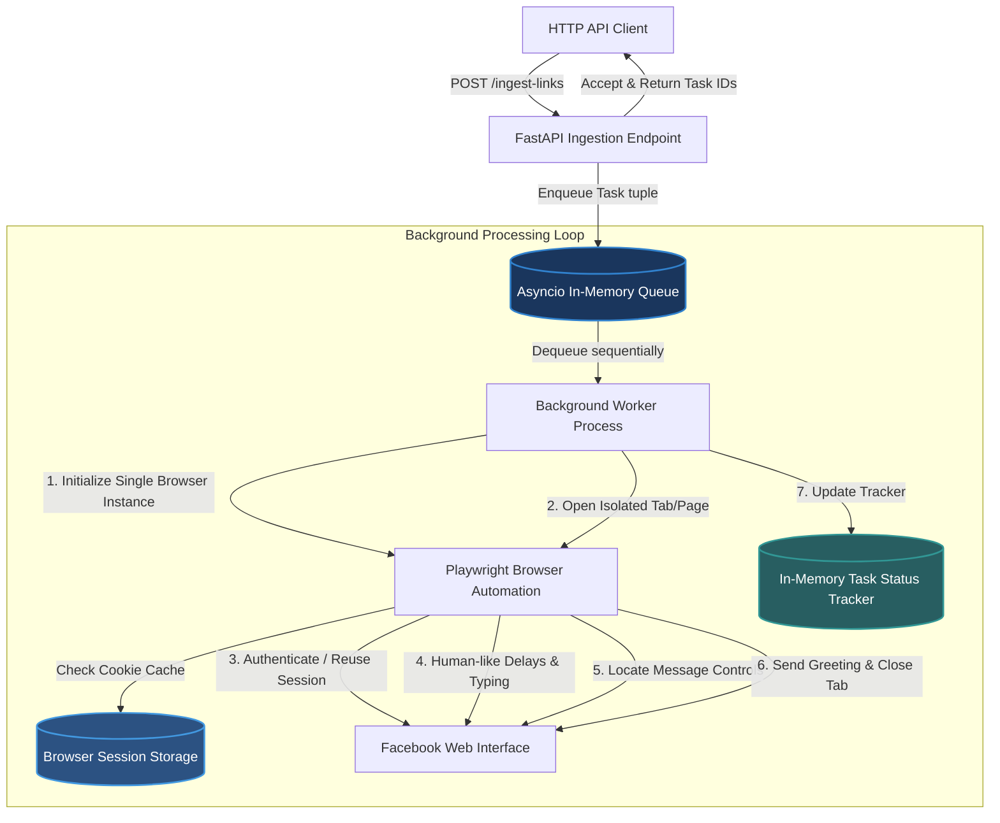

# FastGreet: Automated Messaging Pipeline for Lead Engagement

[](https://fastapi.tiangolo.com/)
[](https://playwright.dev/python/)
[](https://www.docker.com/)
[](https://www.python.org/)

An enterprise-grade, high-performance asynchronous background messaging pipeline engineered to automate initial lead greetings on Facebook. Built on top of **FastAPI**, **Playwright**, and **Docker**, FastGreet provides a non-blocking API ingestion layer coupled with an optimized, sequential execution pipeline that safely simulates natural human messaging workflows while minimizing memory footprint.

---

## 📐 Architecture & Flow

FastGreet operates on a decoupled publisher-subscriber architecture pattern designed to process high-throughput URL ingestion without blocking server network threads.



### Key Technical Capabilities:
* **Robust Multi-Factor Verification & E2EE Bypass**: Handles login verifications gracefully. Safe manual session exporter utility bypasses 2FA, Captcha, and Messenger E2EE (End-to-End Encryption / Secure Storage PIN) by baking them into a persistent browser state folder (`browser_session/`).
* **Docker Containerization**: Easily deployable on multiple headless host machines via Docker & Docker Compose by mounting the active `browser_session/` folder.
* **Persistent Context & Resource Optimization**: The background worker launches a **single persistent browser context** at startup and keeps it alive, reusing it for all sequential profile tasks by simply opening and closing isolated tabs/pages. This **saves ~80% of CPU and RAM** by avoiding constant browser boot overhead.
* **Task Status & Progress Tracking**: Features an in-memory task tracker (`src/tracker.py`) recording the transitions between `queued` ➡️ `processing` ➡️ `completed` or `failed` (including granular error reporting), queryable via REST endpoints.
* **Heuristic Message Button Finder**: Employs a polymorphic selector dictionary prioritizing localized and multi-language DOM labels (`Nhắn tin`, `Message`, `role="textbox"`, etc.) for high structural resilience.
* **Jitter & Human Simulation**: Adds randomized delay ranges between navigation states to mitigate account profiling and block risks.

---

## 📂 Project Directory Structure

```text
autoHello/
├── src/
│   ├── __init__.py
│   ├── config.py         # Type-safe configuration via Pydantic Settings
│   ├── tracker.py        # In-memory status tracking, UUID generation, and task models
│   ├── automation.py     # Persistent context browser driver and DOM selector engine
│   ├── pipeline.py       # Sequential task dispatch loop, browser reuse, and worker lifecycle
│   └── main.py           # FastAPI entrypoint, lifespan context, and routing layers
├── logs/                 # Active system execution logs & screenshot diagnostics
├── browser_session/      # Active, authenticated Chrome profile and cookies (E2EE/2FA synced)
├── Dockerfile            # Production Docker image configuration using Playwright jammy base
├── docker-compose.yml    # Volume mapping and orchestrations for multi-machine deployment
├── check_env.py          # Automatic workspace dependency and binary diagnostic tool
├── login_helper.py       # GUI helper to solve captchas, enter 2FA, configure E2EE & save session
├── pyproject.toml        # Root pyproject metadata and pytest options configuration
├── requirements.txt      # Production and development dependencies manifest
├── .env.example          # Environment variables template file
└── README.md             # Technical documentation
```

---

## 🔐 Hướng dẫn Khởi tạo Session (Bypass 2FA & Mã hóa E2EE)

Facebook áp dụng cơ chế xác thực bảo mật 2 lớp (2FA) và mã hóa đầu cuối Messenger (Secure Storage E2EE). Việc cố gắng đăng nhập tự động trên môi trường không giao diện (headless) sẽ bị Facebook chặn đứng hoàn toàn.

Để bypass thành công, bạn chỉ cần thực hiện đăng nhập và xuất phiên (export session) **một lần duy nhất** trên máy có giao diện màn hình (GUI):

1. **Khởi chạy trình hỗ trợ đăng nhập (Login Helper):**
   ```bash
   autochat_env/bin/python login_helper.py
   ```
2. **Thực hiện Đăng nhập và Đồng bộ hóa:**
   * Một trình duyệt Chromium thực tế sẽ xuất hiện. Tiến hành nhập Email/Password.
   * Nhập mã xác thực 2 lớp (2FA) của bạn.
   * **CỰC KỲ QUAN TRỌNG:** Truy cập trực tiếp địa chỉ `https://www.messenger.com`. Nếu Messenger yêu cầu nhập mã PIN thiết lập "Bộ nhớ an toàn" (Secure Storage PIN), hãy nhập đầy đủ mã PIN của bạn để Messenger tải thành công dữ liệu chat và lưu trữ khóa mã hóa E2EE vào session.
   * Khi thấy danh sách các cuộc hội thoại tải xong hoàn chỉnh, hãy **tắt cửa sổ trình duyệt Chromium**. Cửa sổ terminal sẽ báo: `Session saved successfully.`
3. **Kết quả:** Trạng thái đăng nhập sạch, mã hóa E2EE và cookie hợp lệ đã được lưu trữ trọn vẹn trong thư mục `browser_session/`.

---

## 🐳 Đóng gói Docker & Triển khai trên nhiều máy (Multi-Machine Deployment)

Sau khi có thư mục `browser_session/` chứa session đăng nhập thành công ở bước trên, bạn có thể triển khai hệ thống chạy tự động hoàn toàn ở chế độ headless trên bất kỳ máy chủ nào bằng Docker.

### 1. Cấu hình tệp môi trường
Tạo file `.env` ở thư mục gốc của dự án:
```ini
FB_EMAIL=tuongkoi999@gmail.com
FB_PASSWORD=your_password
GREETING_MESSAGE=Xin chào! Mình muốn kết nối với bạn.
HEADLESS_MODE=true
MIN_DELAY=3
MAX_DELAY=7
```

### 2. Triển khai nhanh bằng Docker Compose (Khuyên dùng)
Docker Compose đã được thiết lập để tự động mount thư mục `browser_session/` vào Container, cho phép tận dụng session đã đăng nhập của bạn:

```bash
# Khởi động dịch vụ ở chế độ chạy ngầm
docker compose up -d
```

Hệ thống sẽ build Docker image dựa trên base image Playwright chính chủ (`mcr.microsoft.com/playwright/python:v1.42.0-jammy`), cài đặt các dependencies và khởi chạy FastAPI API server tại cổng `8080` của máy chủ.

* **Xem log thời gian thực của container:**
  ```bash
  docker compose logs -f
  ```
* **Dừng container:**
  ```bash
  docker compose down
  ```

### 3. Sao chép và chạy trên máy khác (Move to other machines)
Nếu muốn chuyển dự án sang chạy ở một máy khác:
1. Copy toàn bộ thư mục dự án `autoHello/` (bao gồm cả thư mục `browser_session/` đã được đăng nhập) sang máy mới.
2. Tại máy mới (chỉ cần có cài đặt Docker), di chuyển vào thư mục dự án và chạy:
   ```bash
   docker compose up -d
   ```
Không cần phải chạy lại `login_helper.py` trên máy mới, session đã đăng nhập trước đó sẽ được Docker tự động nạp và tiếp tục hoạt động gửi tin nhắn headless cực kỳ ổn định!

---

## 💻 Hướng dẫn Chạy Local không dùng Docker

### 1. Kích hoạt Virtual Environment & Cài đặt Dependencies
**Cho Bash / Zsh:**
```bash
source autochat_env/bin/activate
pip install -r requirements.txt
playwright install chromium
```

### 2. Khởi chạy FastAPI Server
```bash
PYTHONPATH=. autochat_env/bin/uvicorn src.main:app --port 8080 --reload
```
Tài liệu hướng dẫn tương tác OpenAPI (Swagger UI) sẽ hoạt động tại địa chỉ: [http://127.0.0.1:8080/docs](http://127.0.0.1:8080/docs).

---

## 🔌 Tài liệu API tham chiếu nhanh

### 1. Ingest Profile Links
Gửi danh sách liên kết Facebook cần gửi tin nhắn chào mừng. Hỗ trợ hàng đợi không chặn (Non-blocking queue).

* **Method & URL**: `POST http://127.0.0.1:8080/ingest-links`
* **Headers**: `Content-Type: application/json`
* **Payload**:
  ```json
  {
    "links": [
      "https://www.facebook.com/ngynqt",
      "https://www.facebook.com/profile.php?id=100072950083501"
    ]
  }
  ```
* **Response `202 Accepted`**:
  ```json
  {
    "status": "Success",
    "message": "Successfully queued 2 profile link(s) for execution.",
    "task_ids": {
      "https://www.facebook.com/ngynqt/": "a8f4c2e1",
      "https://www.facebook.com/profile.php?id=100072950083501/": "f9b2d8c3"
    }
  }
  ```

### 2. Retrieve All Tasks
Truy vấn thông tin và tiến độ của tất cả các tiến trình trong hệ thống.

* **Method & URL**: `GET http://127.0.0.1:8080/tasks`
* **Response `200 OK`**:
  ```json
  [
    {
      "task_id": "a8f4c2e1",
      "link": "https://www.facebook.com/ngynqt/",
      "status": "completed",
      "error": null,
      "created_at": "2026-05-25T02:14:31.917Z",
      "updated_at": "2026-05-25T02:14:53.398Z"
    }
  ]
  ```

---

## 🧪 Kiểm thử Tự động (Automated Testing)

FastGreet tích hợp bộ test suite đầy đủ cho API endpoints và luồng xử lý hàng đợi bằng `pytest` và `pytest-asyncio`:

```bash
autochat_env/bin/python -m pytest tests/test_main.py -v
```
